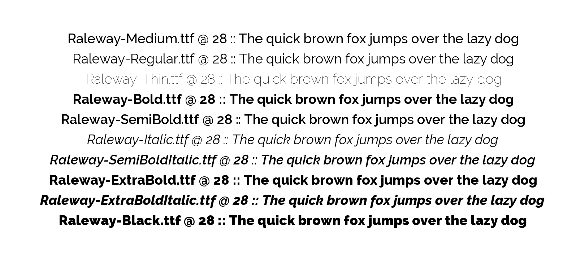

## ofxSmartFont

A sane & simple approach to managing [ofTrueType](http://openframeworks.cc/documentation/graphics/ofTrueTypeFont.html) instances.

**ofxSmartFont** creates, caches and manages [ofTrueType](http://openframeworks.cc/documentation/graphics/ofTrueTypeFont.html) instances over the life of your [OpenFrameworks](http://openframeworks.cc/) application and makes them globally available to any part of your application that needs them.

It generates [smart pointers](http://stackoverflow.com/questions/106508/what-is-a-smart-pointer-and-when-should-i-use-one) that you can pass around your app without fear of dangling pointers and dead references when an [ofTrueType](http://openframeworks.cc/documentation/graphics/ofTrueTypeFont.html) instance inadvertantly goes out of scope.

Fonts are cached to ensure you never load the same one twice and are easily retrieved by name.

--

#### Adding a font

	ofxSmartFont::add("fonts/helvetica_neue.ttf", 12, "helvetica_12");

This returns a [shared pointer](http://stackoverflow.com/questions/106508/what-is-a-smart-pointer-and-when-should-i-use-one) to an **ofxSmartFont** instance that is guaranteed to persist in memory throughout the life of your application.

	shared_ptr<ofxSmartFont> myFont = ofxSmartFont::add(file, size, name);

Note the name field is optional, if it is ommited it will default to the font's filename.
 
-- 

#### Retrieving a font

Retrieving a font is as simple as requesting it by name:

	shared_ptr<ofxSmartFont> helvetica_12pt = ofxSmartFont::get("helvetica_12");

However you can also search against the font's filename by also passing in a point size:

	shared_ptr<ofxSmartFont> helvetica_12pt = ofxSmartFont::get("helvetica", 12);
	
Or by passing in a set of keys:

	vector<string> keys = {"helvetica", "semibold", "italic"};
	shared_ptr<ofxSmartFont> helvetica_semibold_italic_12pt = ofxSmartFont::get(keys, 12);

If a search fails to find what you're looking for it will return a ``nullptr`` that you can test against.

	shared_ptr<ofxSmartFont> helvetica_12pt = ofxSmartFont::get("helvetica_12");
	if (helvetica_12pt != nullptr) cout << "helvetica 12pt found!" << endl;

--

#### Listing Cached Fonts

At any time you can list all of the fonts that are stored in memory via:

	ofxSmartFont::list();
	>> ofxSmartFont :: ------------------------------------------------
	>> ofxSmartFont :: total # of fonts cached = 1
	>> ofxSmartFont :: helvetica_12 (12pt -> fonts/helvetica_neue.ttf)
	>> ofxSmartFont :: ------------------------------------------------

--

#### ofxSmartFont Methods

Once you have a pointer to an ofxSmartFont instance you can call any [ofTrueType](http://openframeworks.cc/documentation/graphics/ofTrueTypeFont.html) method on it + a few additional convenience methods:

	// draw a string at 100, 100 // 
	helvetica_12pt->draw("hello", 100, 100);
	
	// get the bounding box for a string // 
	ofRectangle rect = helvetica_12pt->rect("hello");
	
	// get the width of a string // 
	int width = helvetica_12pt->width("hello");
	
	// get the height of a string // 
	int height = helvetica_12pt->height("hello");
	
	// set the name //
	helvetica_12pt->name("my_first_font");
	
	// get the name //
	string name = helvetica_12pt->name();
	
	// get the font size //
	int size = helvetica_12pt->size();
	
	// get the file name //
	string file = helvetica_12pt->file();

